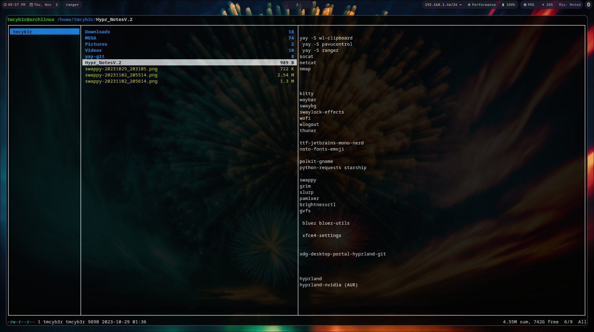

   <h1 align="center"> ☬тм¢увєя☬ Hypr S3C V2 </h1>
<h1 align="center">
  <br>
  <a href="https://github.com/tmcybers/Hypr-S3C"></a>
  <a href="https://github.com/tmcybers/Hypr-S3C"></a>
  <a href="https://github.com/tmcybers/Hypr-S3C"></a>
  <a href="https://github.com/tmcybers/Hypr-S3C"></a>
</h1>

[](https://twitter.com/tmcybers)
[](https://tmcybers.github.io/)
[](https://medium.com/@tmcybers)
[](https://twitter.com/tmcybers)
[](https://twitter.com/tmcybers)
[](https://twitter.com/tmcybers)


## Hypr-S3C FULL Wiki Installation is proved here also nvidia boosted [https://github.com/tmcybers/Hypr-S3C]

# Please -Read
## Full hardware installation no VMs.
* Nvidia Gpu full compatibilty.
* Rog Strix G17 Machine full Linux hardware installation, contro rog center, fan, gpu.
* Arch linux vanilla installation is fully recomended, use tty.
* Install nvidia from tty, don't even try run hypr, if you are on nvidia only.
* Install arch fresh and then proceed below.


## Master Installation

### Yay

> You can use pacman or paru, I like yay.
```
pacman -S --needed git base-devel
git clone https://aur.archlinux.org/yay.git
cd yay
makepkg -si

# delete yay files after the completion (optional) 
cd .. && rm -rf yay
```

# Hypr Installation

| Type | Package(s) |
| ----------- | ----------- |
| hypr | hyrpland |
| hypr nvidia opcional | hyprland-nvidia (AUR) |
| Font dependencies | ttf-jetbrains-mono-nerd noto-fonts-emoji  |
| Extra Fonts | noto-fonts-emoji nerd-fonts-complete-mono-glyphs ttf-nerd-fonts-symbols-commons papirus-icon-theme dunst otf-sora ttf-nerd-fonts-symbols-common otf-firamono-nerd inter-font ttf-fantasque-nerd noto-fonts noto-fonts-emoji ttf-comfortaa ttf-jetbrains-mono-nerd ttf-icomoon-feather ttf-iosevka-nerd adobe-source-code-pro-fonts|
| Extra Icons | https://github.com/Templarian/MaterialDesign-Font |
| Extra Themes | nordic-theme (AUR) |
| E-Mail | thunderbird tutanota |
| Fetch | nitch |
| Misc | btop | lsd bat btop tldr stow wl-clipboard unzip yt-dlp |
| RSS News | newsboat |
| Shell | zsh |
| Terminal Prompt | starship |
| Coder | visual-studio-code-bin dotnet-sdk dotnet-runtime dotnet-sdk |
| Editor Code | mousepad |
| Text Editor | neovim |
| Pdf viewer | zathura |
| Image viewer | viewnior |
| Player | mpv + cava |
| Clipboard manager | wl-clipboard |
| Terminal | kitty |
| Bar | waybar |
| Wallaper setter | hyprpaper |
| Lock-er | swaylock-effects |
| Launcher | wofi |
| Log-out | wlogout |
| Gui file manager (opcional) | thunar | 
| Browser | brave-bin |
| Terminal file manager | ranger |    
| Graphical authentication | polkit-gnome |
| client library for Python | python-requests |
| image viewer screen-capture | swappy grim slurp |
| audio mixer | pamixer pavucontrol |
| brightness control (only laptop) | brightnessctl |
| userspace virtual filesystem implementation for GIO  | gvfs |
| XDG Desktop Portal Must Have| xdg-desktop-portal-hyprland-git |
| bluetooth | bluez bluez-utils |
| Settings themer (ocional) | xfce4-settings |
| Theme Icons Fonts | nwg-look |
| Recorder (opcional) | wf-recorder |
| Plugin for Voice | noise-suppression-for-voice  |
| Stream-record | obs-studio |

# Hypr S3C Installation for Cybersecurity (Opcional)

>> Tools i use daily, knife arms must have.
> Opcional to this u can use black_arch script, and install asap.

| Type | Package(s) |
| ----------- | ----------- |
| Browser | torbrowser-launcher |
| Anonymizing  | tor torsocks onionshare |
| VPN | Mullvad |
| Socks | python-pysocks shadowsocks |
| Tools Networking | netcat nmap |
| Tools Networking GUI | wireshark |
| EDR - SIEM| wazuh | 
| Networking interfaces| net-tools |
| Multipurpose relay | socat |
| Security testing of web applications | burpsuite |
| Configurable targeted scanning based on templates | nuclei |
| Swiss army knife for network attacks and monitoring | bettercap |
| Powerful vulnerability scanning and vulnerability | openvas |
| Hide encrypted messages in plain text | stegcloak |
| Crack passwds audit | hashcat |
| WiFi security auditing tools suite | aircrack-ng-git |
| vulnerability assessment | nessus | nessus is not free, opcional to you|


# Simple “fixes”

>> Fixes for flicker-ing and slowness on hypr wayland based apps ifound on time.


*Vscode*

A basic fix is to launch VSCode in a shell with the --disable-gpu argument:
```
$ code uncheck use hardware acceleration…--disable-gpu
```

**Browser Flashing and acting strangely**
```
Settings > system > uncheck use hardware acceleration…
```

`uncheck use hardware acceleration…on most apps when acting strange, wayland based`

**Flickering happening only on brave browser**
```
disable Hardware Acceleration via brave://settings/system resolves the issue.
```


# Clean out other portals

    yay -R --noconfirm xdg-desktop-portal-gnome xdg-desktop-portal-gtk


   chmod +x ~/.config/hypr/xdg-portal-hyprland


 >> chmod +x on scripts. important.


